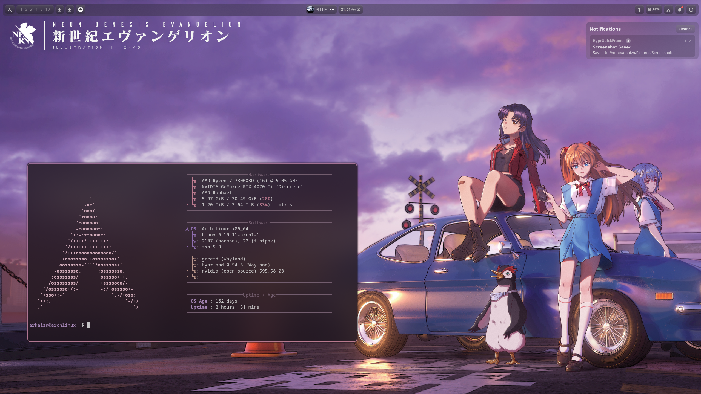
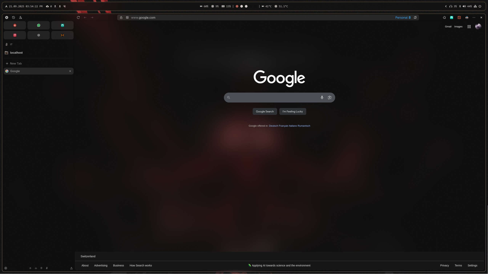
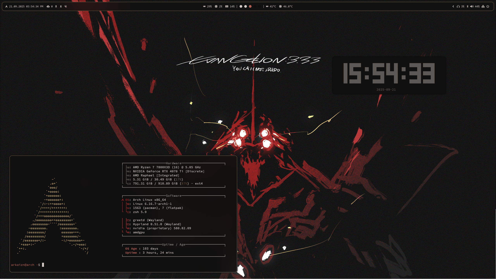
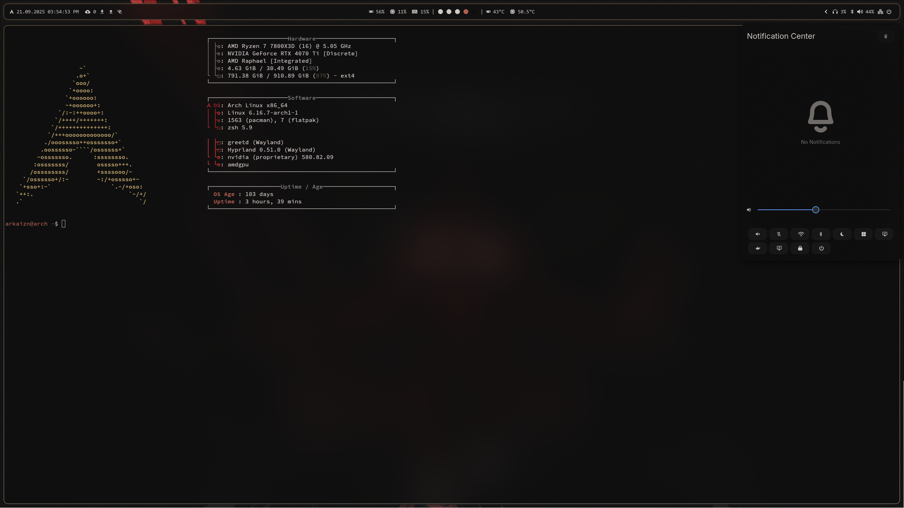

<!-- Improved compatibility of back to top link: See: https://gitlab.silnas.ch/othneildrew/Best-README-Template/pull/73 -->
<a id="readme-top"></a>

<!-- PROJECT SHIELDS -->
[![License][license-shield]][license-url]
 
<!-- PROJECT LOGO -->
<br />
<div align="center">
  <a href="https://gitlab.silnas.ch/arkaizn/dotfiles">
    
  </a>

  <h3 align="center">Arch Linux Setup Scripts</h3>

  <p align="center">
    Automate your Arch Linux installation with a fully configured GUI and system settings.
    <br />
    <a href="https://github.com/arkaizn/Dotfiles/issues/new?labels=bug&template=bug-report---.md">Report Bug</a>
    ·
    <a href="https://github.com/arkaizn/Dotfiles/issues/new?labels=enhancement&template=feature-request---.md">Request Feature</a>
  </p>
</div>

<!-- TABLE OF CONTENTS -->
<details>
  <summary>Table of Contents</summary>
  <ol>
    <li><a href="#about-the-project">About The Project</a></li>
    <li><a href="#getting-started">Getting Started</a></li>
    <li><a href="#Screenshots">Screenshots</a></li>
    <li><a href="#project-structure">Project Structure</a></li>
    <li><a href="#license">License</a></li>
  </ol>
</details>

<!-- ABOUT THE PROJECT -->
## About The Project  

This project provides a collection of scripts to automate the installation and configuration of Arch Linux. It transforms a base Arch installation into a fully functional system with a graphical user interface (GUI) and essential configurations, making it ready for daily use.  

<!-- GETTING STARTED -->
## Getting Started

To get started with this project, follow these simple steps.

### Prerequisites

- A fresh installation of Arch Linux.
- Basic knowledge of Linux commands.

### Installation

1. Clone the repository:
   ```sh
   git clone https://gitlab.silnas.ch/arkaizn/Dotfiles
   cd Dotfiles
   ```

2. Run the installation script:
   ```sh
   ./install.sh
   ```

## Screenshots
<!-- Screenshots  -->







<!-- Project Structure -->
## Project Structure

```
    dotfiles/
    ├── .config/
    │   └── hypr/
    │       ├── hyprland.conf
    │       └── ...
    ├── additions/
    │   ├── apps.sh
    │   ├── openrgb/
    │   │   └── openrgb.sh
    │   └── nvidia.sh
    ├── images/
    │   └── ...
    ├── scripts/
    │   ├── config.sh
    │   ├── icons.sh
    │   ├── packages.sh
    │   ├── theme.sh
    │   └── zshinstall.sh
    ├── LICENSE
    ├── README.md
    ├── install.sh
    ├── postinstall.sh
    └── refresh.sh
```

<!-- LICENSE -->
## License

This project is licensed under the GNU License. See [LICENSE](https://gitlab.silnas.ch/arkaizn/dotfiles/-/blob/main/LICENSE) for more details.

<!-- MARKDOWN LINKS & IMAGES -->
[license-shield]: https://img.shields.io/github/license/arkaizn/dotfiles
[license-url]: https://gitlab.silnas.ch/arkaizn/dotfiles/-/blob/main/LICENSE

